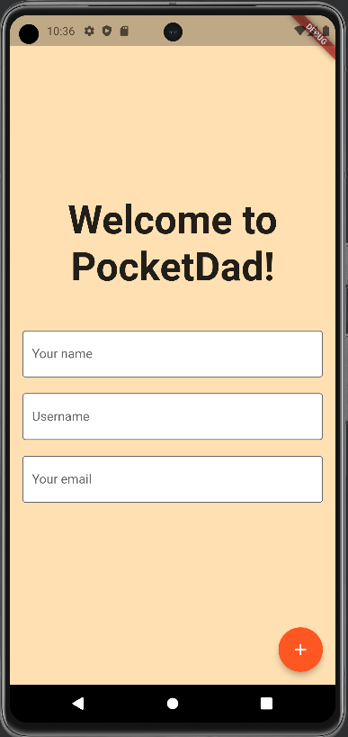
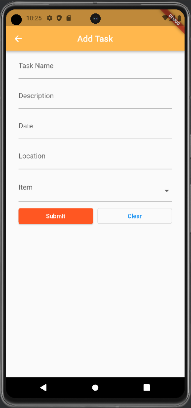

# PocketDad
[GitHub Repository Link](https://github.com/PocketDad/pocketdad)

## Table of Contents
* [Motivation](#motivation)
* [Goals](#goals)
* [Usage](#usage)
* [Installation](#installation)
* [Development status](#development-status)
* [About us](#about-us)

## Motivation
Many young people have to navigate early adulthood without sufficient guidance for facing practical challenges. 
These challenges may include keeping up with regular maintenance tasks associated with their house or car, remembering to pay their taxes, or simply tying a tie.


## Goals
PocketDad is a personal digital assistant that will remind the user of important tasks, such as filing taxes, cleaning the air filters in their home, or checking the tread of their tires before the winter season.
It will also provide instructions on how to carry out these tasks as well as recommendations for specific maintenance services.
PocketDad will also be able to offer general advice directed toward the specific user based on its knowledge of them.


## Usage

Phase 1: Currently our app consists of mockup pages.

| Choose Avatar |  | This page will display different Dad avatars for the user to choose from. |

| Check-in |  | This page will inform the user of their tasks and reminders for the day. |

| Add Task |  | This form will enable the user to add tasks to their to-do list. |

| Edit Task |  | The user will be able to edit existing tasks. |

| Display All Tasks |  | This page will display a list of the user's existing tasks. |

| Completed Tasks |  | This page will allow the user to return to completed tasks for reference and tracking purposes. |

Phase 2: Updating our app to include data from a hard-coded database and other mockup pages. These pages utilize User, Task, and Item databases that have been hard-coded with sample data.

| Items Page with Data |  | Items page implemented with sample data. |

| Sign-up Page (Mockup) |  | New users can register through the sign-in page. |

| Individual Tasks Page |  | Information for each task can be viewed independently. |

| --- |

Phase 3: Implementing Riverpod methods for databases and continuing to add to UI.

| Sign-up Page |  | The sign-up page adds a new user to the existing database of users. |

| Check-in |  | Page displaying check-in information accessed through Riverpod providers. |

| All Tasks |  | Page displaying all tasks for each user accessed through Riverpod providers. |

| Add Task |  | Adds a new task to the existing database of tasks. |

| Choose Avatar |  | Sets or changes the Dad avatar. |

## Installation
Download the source code found in the [PocketDad Repository](https://github.com/PocketDad/pocketdad).
In a terminal, cd into the pocketdad directory and run:
```
flutter run
```

## Development status
* [PocketDad Projectboard](https://github.com/orgs/PocketDad/projects/5)

## About us
PocketDad is being developed by a team of three Computer Science students from the University of Hawaiʻi at Mānoa.

Team members:
* [Yong-Sung Masuda](https://github.com/yongsungm)
* [Sydney Kim](https://github.com/kimsyd)
* [Justin Jandoc](https://github.com/justinjandoc)
